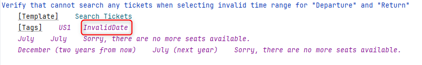

Ensure Python is installed in your system (Tested in Python version 3.12)

Install Poetry 

```Bash
pip install poetry
```
Install dependencies needed for the project

```Bash
poetry install
```
Build the test library
```Bash
poetry build
```
Activate the virtual environment in project
```Bash
.venv/Scripts/activate
```
Install the test library to the virtual environment
```Bash
pip install --force-reinstall --find-links=dist trangptt_test_library
```
Install Playwright dependencies
```Bash
rfbrowser init
```

Command to execute all test cases with tag "MarsAir"
```Bash
robot --include MarsAir --outputdir reports --variable configuration_base:tests/resources/configurations/global.yaml ./
```
We just change the tag after "--include" to run test cases in each user story.For User Story 1, we can use the following command.
```Bash
robot --include US1 --outputdir reports --variable configuration_base:tests/resources/configurations/global.yaml ./
```
Moreover, I also add more tags for some specific test, you can use them to run test  
